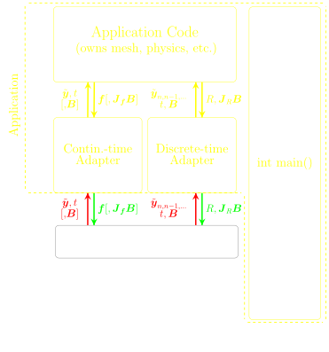

Overview
========

\todo: finish

* graphic needs to be updated
* ROMs are dense
* pressio was designed with that in mind

In a nutshell
-------------

Pressio contains model reduction methods supported applicable
to any dynamical system expressible in
a *continuous-time* form as

.. math::

    \frac{d \boldsymbol{y}}{dt} =
    \boldsymbol{f}(\boldsymbol{y},t; ...)

and/or in a *discrete-time* form

.. math::

    \boldsymbol{R}(\boldsymbol{y}, \boldsymbol{y_{n-1}}, ..., t_n, dt_n; ...) = \boldsymbol{0}

Here, :math:`y` is the full-order model (FOM) state,
:math:`f` the FOM velocity, :math:`t` is time, and :math:`R` is the residual.

We leverage this expressive mathematical framework as a pivotal
design choice to enable a minimal application programming interface (API)
that is natural to dynamical systems: you choose the formulation
more convenient to you, and interface your application to
Pressio by creating a corresponding *adapter class* to expose
the operators needed for the chosen formulation.
In general, you don't need to support both: there are advantages and disadvantages for both,
and sometimes the choice is dictated directly by your native application (for example,
in some cases it might be easier to directly expose the residual).
Read `the doc page <components/rom_fom_apis.html>`_
to learn more about the adapter classes and see code templates.

